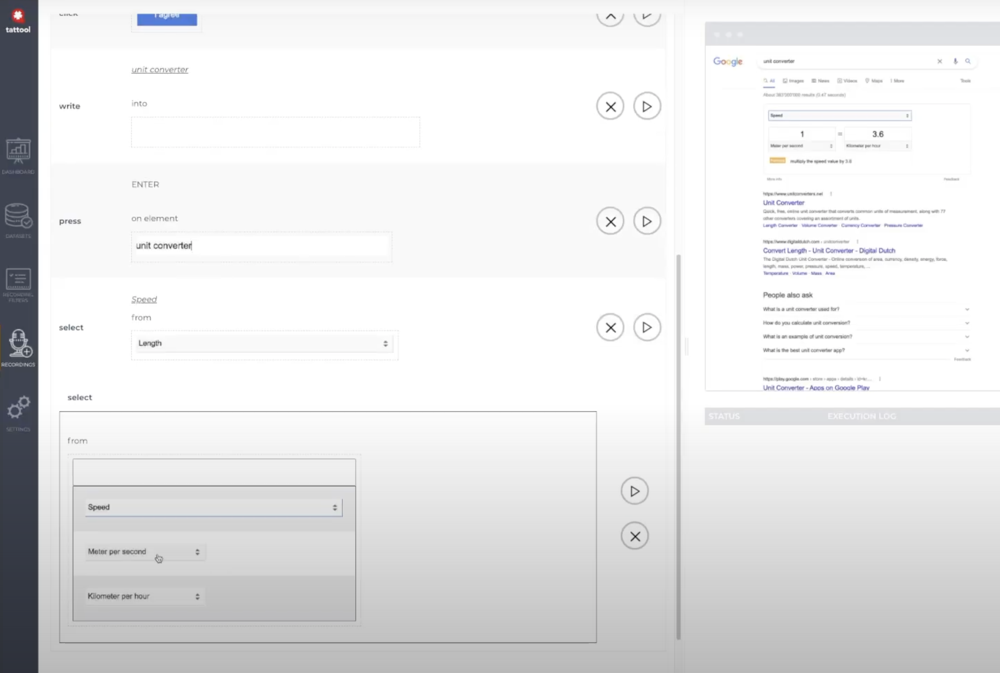
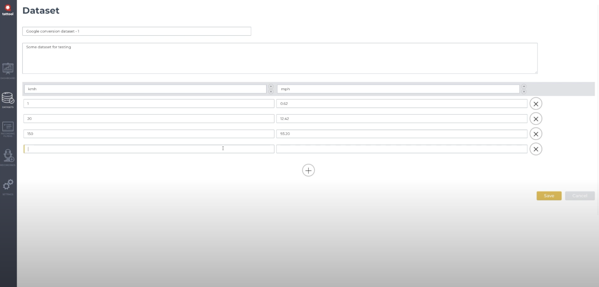
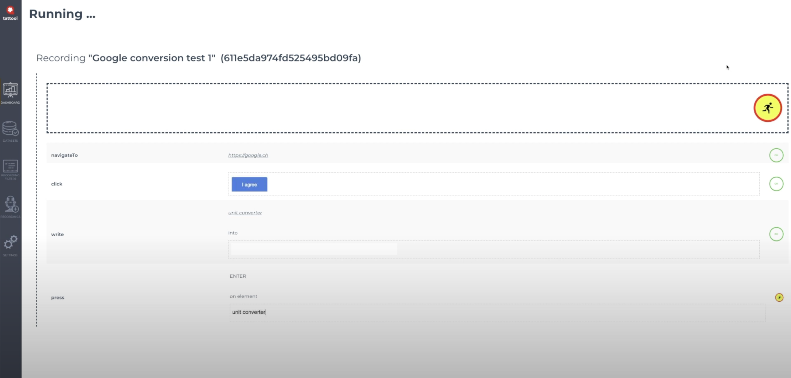
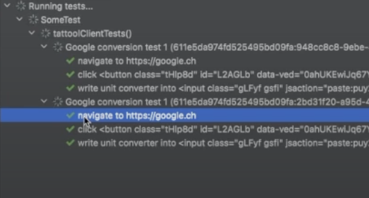

# TATTOOL

A **toolkit** for building collaborative custom in-house QA automation solutions

**⚠️⚠️⚠️ WARNING ⚠️⚠️⚠️** 

Experimental **WORK IN PROGRESS** 

Any type of help would be greatly appreciated. Consider looking into issues list.

## Description

Tattool was created with the following workflow in mind :

- A user [records a scenario](https://youtu.be/m_XmGCTR7fo?t=21) with a visual tool, without any need to know the underlying implementation of a platform.

- The system creates a recording for this scenario. The recording is a list of commands performed on visual elements. These visual elements are transcribed into smart / resilient locators (ElementSuperLocator) for execution.

- The user can organize these recordings into groups of recordings (aka recording filters) by using tag selectors.

- The user can also [play both recordings](https://youtu.be/m_XmGCTR7fo?t=93) and recording filters.

- The user can [create datasets](https://youtu.be/m_XmGCTR7fo?t=122) in order to provide examples for recordings

- The user can [map recording steps to dataset](https://youtu.be/m_XmGCTR7fo?t=178) columns. This will transpile recordings into recording instances (one per dataset row).

- The user can view [live reporting](https://youtu.be/m_XmGCTR7fo?t=208) for the execution of any recording / recording filter

- The user / a developer can [integrate executions with a delivery pipeline](https://youtu.be/m_XmGCTR7fo?t=364).

## Features

- Visual test recording
- Dataset creation and mapping (for data driven test creation)
- Test suite creation and execution
- Test / test suite parallel execution
- Test run reporting
- CI/CD integration

Please check this [video](https://www.youtube.com/watch?v=m_XmGCTR7fo) for an overview 

## Main concepts

### Platform

A platform represents the testing target (i.e. web, mobile, api). 

It is responsible for creating/destroying sessions. It also provides a set of available commands that can be executed in a session context for this particular platform.

At this stage there is  1 implementation available : [platform-web](./backend/platform-web)

### Session

Provided by platform. Responsible for executing commands in a recording context.

### Recording

A user captured set of commands for a given session. 

This is a playable item.

### Recording filter

A tag based test-set. It will dynamically match recordings with same tags in order to create a recording list. 

This is also a playable item.

### Dataset

A set of rows containing examples to be played for a given recording.

Can be mapped when editing a recording.

### Run

A report detailing run status. Provides live data when running.

### ElementSuperLocator

Provides a way to describe a visible element in a resilient way.

## Modules

### Backend

#### Core

An Hexagonal project containing core concepts.

#### Platform-Web

A chrome-headless implementation of a Platform.

#### Server

A spring-boot server, responsible for persisting state and providing an API to clients.

#### Client

A JUnit runner implementation for CI-CD integration.

### FrontEnd

A Vue3 (composition-api) client containing several tools :

- A recorder : for session recording

- A recording filter interface : To create tag based recording filters (aka test-sets)

- A dataset tool : To create datasets in order to build data-driven tests

- A player : To play recordings and recording filters

- A run-viewer : Show live / finished state for runs

## How to

TBD

## Roadmap

Docker-compose basic configuration

User Management

Session provider

Code cleanup

Shadow dom support

## Known issues

TBD

## Warning

This effort started as a side project. It will be maintained during free time.

Any help will be greatly appreciated. 

For now, please **consider this code as Alpha**. **This is not a off-the-shelf product**. It will not work out of the box, and will require a certain amount of time / skills in order to work, given a specific testable project.

I emphasize that this is not a finished product, but rather a toolbox that can save you a lot of time and energy if used correctly.

# Credits

Most of the icons in the application come from icons8.com
